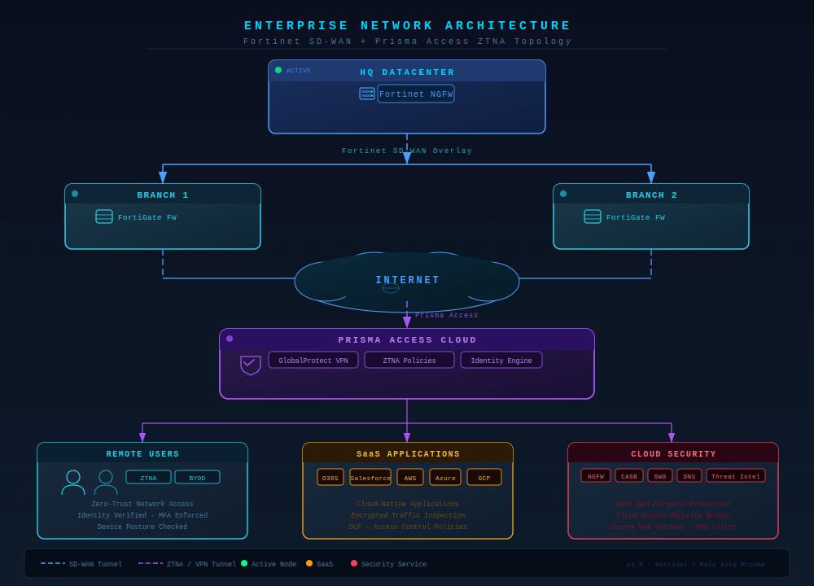

# 🚀 SASE Architecture: Prisma Access + Fortinet SD-WAN

## 📌 Overview
This project demonstrates a production-grade Secure Access Service Edge (SASE) architecture integrating:
- Prisma Access (ZTNA, SWG, CASB, DLP)
- Fortinet SD-WAN (branch connectivity)
- Zero Trust security model for hybrid workforce

---

## 🚨 Problem Statement
Traditional VPN-based architectures:
- Do not scale for remote users
- Lack visibility into SaaS traffic
- Increase attack surface

---

## 💡 Solution
This architecture provides:
- Zero Trust Network Access (ZTNA)
- Cloud-delivered security via Prisma Access
- Intelligent traffic routing using Fortinet SD-WAN

---

## 🏗️ Architecture Diagram

---

## 🔄 Traffic Flow

### Remote User → SaaS
1. User connects to Prisma Access
2. Authentication via Identity Provider
3. ZTNA policy enforcement
4. Secure access to SaaS apps

### Branch → Data Center / Internet
1. Traffic enters FortiGate firewall
2. SD-WAN selects best path
3. IPSec tunnel to Prisma Access
4. Security inspection applied

---

## 🔐 Security Controls
- URL Filtering
- CASB
- Data Loss Prevention (DLP)
- Threat Prevention
- Zero Trust Policy Enforcement

---

## ⚙️ Technologies Used
- Palo Alto Prisma Access
- Fortinet FortiGate SD-WAN
- IPSec VPN
- Zero Trust Architecture

---

## ⚡ Operational Troubleshooting Playbooks

The project includes real-world incident handling examples:

| Scenario | Document |
|----------|----------|
| Application Access Failures | [app-access-fail.md](troubleshooting/app-access-fail.md) |
| SD-WAN Tunnel Down | [tunnel-down.md](troubleshooting/tunnel-down.md) |
| Zero Trust Access Issues | [ztna-issues.md](troubleshooting/ztna-issues.md) |

**Value:** Demonstrates hands-on experience resolving production-like SD-WAN and Zero Trust incidents, showing operational maturity and enterprise-level problem-solving skills.

---

## 🎯 Outcome
- Secure hybrid workforce
- Reduced attack surface
- Centralized policy control
